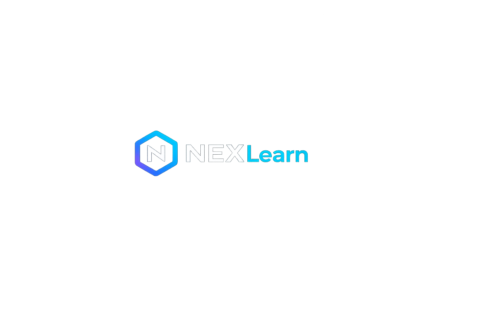
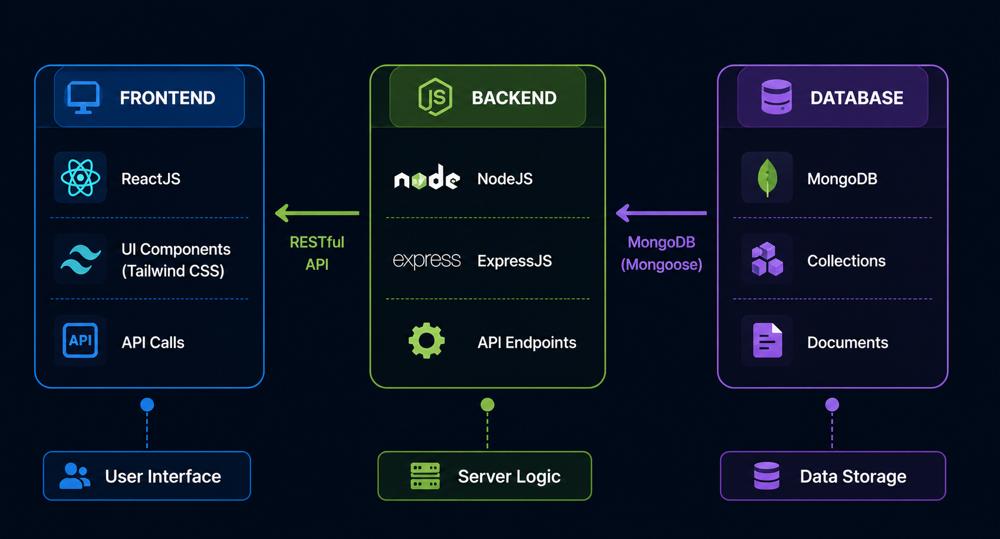
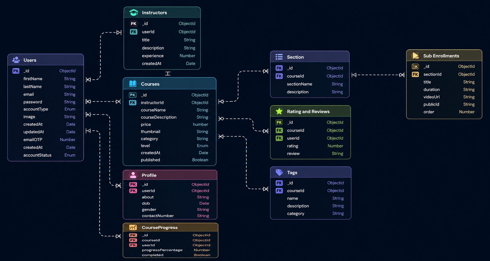

# 🚀 NexLearn — AI-Powered Learning Platform
<div align="center">
  
 <br />
  

  **Learn. Build. Grow. Smarter.**

  NexLearn is a full-stack AI-powered EdTech platform that connects students and instructors in one interactive learning ecosystem.

</div>

---
## 🌐 Live Demo

🚀 **Frontend:** https://nex-learn-two.vercel.app/

---

## 📌 About NexLearn

NexLearn is a full-stack learning management platform built to make online education more interactive, accessible, and intelligent.

Students can discover courses, enroll securely, track their learning progress, rate courses, and receive personalized learning and career guidance from **NEX AI Advisor**.

Instructors can create, manage, publish, and analyze their courses through a dedicated instructor dashboard.

---

## ✨ Key Features

### 🤖 NEX AI Advisor

- Personalized learning roadmaps
- Career guidance
- Skill-gap analysis
- Technology learning paths
- Internship and job preparation guidance
- AI-powered recommendations
- Secure access for authenticated users

### 🎓 Student Experience

- Browse courses by category
- View detailed course information
- Secure course enrollment
- Watch course lectures
- Track course completion progress
- Rate and review courses
- Manage enrolled courses
- Update profile and display picture

### 🧑‍🏫 Instructor Dashboard

- Create and publish courses
- Add sections and video lectures
- Upload course thumbnails and media
- Edit existing courses
- Manage created courses
- View student enrollment statistics
- Analyze course performance and revenue

### 🔐 Authentication & Security

- Student and Instructor accounts
- OTP-based email verification
- Secure login and signup
- JWT authentication
- Protected frontend routes
- Role-based authorization
- Password reset and update

### 💳 Payments & Media

- Razorpay payment integration
- Cloudinary image and video uploads
- Course enrollment after successful payment
- Email notifications

---

## 🧠 NEX AI Advisor Architecture

The AI Advisor follows a secure backend-driven architecture:

```text
User
  ↓
React AI Advisor Interface
  ↓
Frontend API Service
  ↓
Protected Express Route
  ↓
JWT Authentication Middleware
  ↓
NEX AI Advisor Controller
  ↓
Groq AI API
  ↓
Personalized Learning & Career Guidance
```

The AI provider API key remains on the backend and is never exposed to the client.

---

## 🏗️ System Architecture

<p align="center">
  
</p>

---

## 🗄️ Database Schema

<p align="center">
  
</p>

---

## 🖥️ Platform Preview

<p align="center">
  
</p>

---

## 🛠️ Tech Stack

### Frontend

- React.js
- JavaScript
- Redux Toolkit
- React Router
- Tailwind CSS
- Axios
- React Icons

### Backend

- Node.js
- Express.js
- MongoDB
- Mongoose
- JWT Authentication
- Bcrypt
- Nodemailer

### AI Integration

- Groq SDK
- Llama 3.3 70B Versatile
- Custom NEX AI Advisor system instructions

### Cloud & Payments

- Cloudinary
- Razorpay

---

## 📂 Project Structure

```text
NexLearn/
│
├── public/
│
├── src/
│   ├── assets/
│   ├── components/
│   │   ├── common/
│   │   └── core/
│   ├── data/
│   ├── hooks/
│   ├── pages/
│   │   └── AIAdvisor.jsx
│   ├── reducer/
│   ├── services/
│   │   └── operations/
│   │       └── AIAdvisorAPI.js
│   ├── slices/
│   └── utils/
│
├── SERVER/
│   ├── config/
│   ├── controllers/
│   │   └── AIAdvisor.js
│   ├── mail/
│   ├── middlewares/
│   ├── models/
│   ├── routes/
│   │   └── AIAdvisor.js
│   ├── utils/
│   └── index.js
│
├── images/
│   ├── architecture.png
│   ├── mainpage.png
│   └── schema.png
│
├── .gitignore
├── package.json
└── README.md
```

---

## ⚙️ Installation and Setup

### 1. Clone the repository

```bash
git clone <YOUR_REPOSITORY_URL>
cd NexLearn
```

### 2. Install frontend dependencies

```bash
npm install
```

### 3. Install backend dependencies

```bash
cd SERVER
npm install
cd ..
```

### 4. Configure environment variables

Create a `.env` file in the project root:

```env
REACT_APP_BASE_URL=http://localhost:4000/api/v1
```

Create another `.env` file inside the `SERVER` directory:

```env
PORT=4000

MONGODB_URL=your_mongodb_connection_string

JWT_SECRET=your_jwt_secret

MAIL_HOST=your_mail_host
MAIL_USER=your_email
MAIL_PASS=your_email_app_password

FOLDER_NAME=NEXLearn

RAZORPAY_KEY=your_razorpay_key
RAZORPAY_SECRET=your_razorpay_secret

CLOUD_NAME=your_cloudinary_cloud_name
API_KEY=your_cloudinary_api_key
API_SECRET=your_cloudinary_api_secret

GROQ_API_KEY=your_groq_api_key

FRONTEND_URL=http://localhost:3000
```

> Never commit `.env` files or API keys to GitHub.

### 5. Run the application

From the root directory:

```bash
npm run dev
```

The application runs at:

```text
Frontend: http://localhost:3000
Backend:  http://localhost:4000
```

---

## 🔒 Environment Security

Sensitive credentials are excluded from version control through `.gitignore`.

The following files must never be committed:

```text
.env
SERVER/.env
node_modules/
SERVER/node_modules/
```

---

## 🔮 Future Improvements

- Context-aware multi-turn AI conversations
- AI recommendations based on enrolled courses
- Personalized student skill profiles
- AI-generated weekly study plans
- Conversation history for NEX AI Advisor
- Course recommendation engine
- Resume and career roadmap analysis
- Instructor AI assistant
- Real-time notifications
  

---

## 👨‍💻 Author

**Jyoti Ranjan**

Computer Science & Engineering  
National Institute of Technology Patna

---

## ⭐ Support

If you find NexLearn useful, consider giving the repository a ⭐.

---

<div align="center">

  **Built with 💙 for smarter learning**

  ### NexLearn — Learn. Build. Grow Smarter.

</div>
